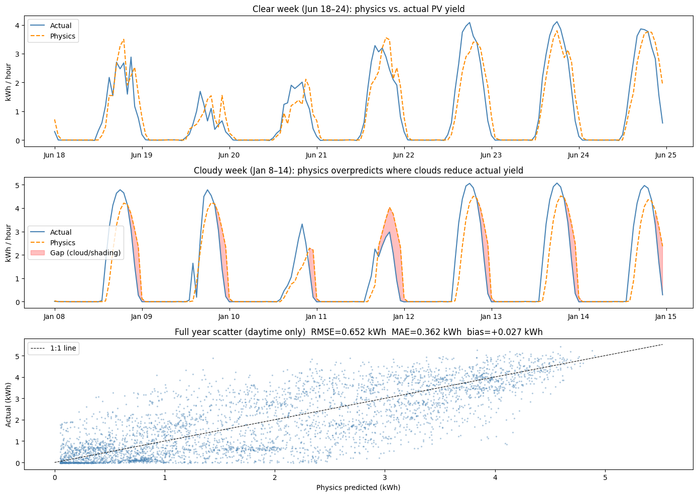

# Hybrid Solar Generation Forecasting & Battery Dispatch Optimization
 
A physics-first, ML-corrected forecasting pipeline for residential solar generation, extended into probabilistic (quantile) forecasts and a linear-programming battery dispatch optimizer. Built and validated end-to-end on real smart-meter data from the Pecan Street Dataport.



## Quickstart

Requires Python 3.11. Weather for notebook 01 is fetched from the Open-Meteo archive API, so it needs internet access.

```bash
pip install -r requirements.txt                          # pinned environment + the local solaros package
tar xzf data/raw/15minute_data_austin.tar.gz -C data/raw/
pytest                                                   # unit tests for src/solaros
```

Then run the notebooks in order, `notebooks/01_data_pipeline.ipynb` through `notebooks/05_battery_dispatch.ipynb`, from inside `notebooks/`. Notebook 01 reads `data/raw/15minute_data_austin/15minute_data_austin.csv` and writes `data/processed/unified_2018_661.parquet`, which notebooks 02–05 read (02 adds the physics column). CI (`.github/workflows/notebooks.yml`) runs the unit tests and then all five notebooks in this order.

## Overview
 
This project answers a practical question: **given a home with solar panels and a battery, how should the battery charge and discharge to minimize electricity cost, using only a forecast of tomorrow's generation and load?**
 
The system is built in five stages, each in its own notebook, connected by a shared data contract. Each stage was independently reviewed and executably verified (run clean, end-to-end, against real data) before being signed off.
 
| Notebook | Stage | Core result |
|---|---|---|
| `01_data_pipeline.ipynb` | Data ingestion | Unified hourly load/PV/weather dataset |
| `02_physics_baseline.ipynb` | Physics model | PV generation forecast from first principles (pvlib) |
| `03_ml_residual_model.ipynb` | ML correction | LightGBM model on physics residuals |
| `04_quantile_forecast.ipynb` | Uncertainty | 5-quantile probabilistic generation forecast |
| `05_battery_dispatch.ipynb` | Decision layer | LP-based battery dispatch under uncertainty |
 
## Data
 
- **Source:** Pecan Street Dataport, university access, static 2018 release
- **Target home:** Dataport ID 661, Austin, TX (30.2672° N, 97.7431° W)
- **Resolution:** 15-minute electricity data, resampled to hourly
- **Coverage:** Full calendar year 2018 (25 Austin homes in this release; **2018 only — a property of the static dataset, not a modeling choice**, confirmed by direct SQLite query against `15minute_data_austin.sqlite3`)
- **System geometry:** confirmed via Dataport metadata — 180° azimuth (south-facing), 6.3 kW DC nameplate capacity, installed 2007
- **Weather:** Open-Meteo archive API, fetched in UTC
- **Household load definition:** `grid + solar` (gross consumption, since the raw schema has no `use` column)
- **Data contract between notebooks:** `data/processed/unified_2018_661.parquet`
## Methodology
 
### 1. Physics baseline (pvlib)
Solar position → Erbs GHI decomposition → plane-of-array transposition → PVWatts DC/AC conversion (Faiman temperature model). Capacity was initially fitted to observed peak output (5.6 kW) but corrected to the Dataport-confirmed nameplate of 6.3 kW plus 16% total system losses (14% PVWatts standard + 2% panel aging). The corrected model achieves a clear-day peak ratio of 1.001 and near-zero bias — a materially better physical result than the fitted value, even though it uses a *larger* nameplate figure.
 
**Result:** RMSE 0.652 kWh, near-zero bias, validated against clear-sky days.
 
### 2. ML residual correction (LightGBM)
Physics gets the shape right but leaves systematic error, particularly at low winter sun angles. A LightGBM model trained on the residual (actual − physics) closes this gap.
 
**Result:** 33% RMSE improvement over the corrected physics baseline on a chronological Oct–Dec holdout. (This is *down* from an initial 36% measured against the uncorrected 5.6 kW baseline — expected and correct, since the improved physics now explains more of the signal itself, leaving less for the ML layer to fix.) Diagnostic finding: the hybrid gains the most on clear days, not cloudy ones — traced to systematic geometry bias at low sun angles rather than cloud attenuation, since GHI already captures cloud effects.
 
### 3. Quantile forecasting
Point forecasts hide risk. Five LightGBM quantile regressors (τ = 0.05, 0.25, 0.5, 0.75, 0.95) are trained on the residual to produce a calibrated uncertainty fan.
 
**Result — reported honestly rather than optimistically:** calibration is materially off on the test period. The model learned a positive residual mean from Jan–Jul and over-applied it to Oct–Dec, a residual-space seasonal distribution shift. Conformal recalibration on an Aug–Sep validation slice was tested and found structurally unable to fix this, since the calibration slice precedes the seasonal break it would need to correct for. A gate check (PASS/FAIL per quantile) is built into the notebook. **q05 is the designated dispatch quantile**, with an empirically verified ~77% coverage floor — the one quantile whose calibration can be trusted enough to act on.
 
### 4. Battery dispatch optimization (scipy.optimize.linprog LP)
A rolling linear program dispatches the battery hour-by-hour against forecasted generation and load, under Austin's time-of-use tariff structure. During review, a double-counted discharge efficiency bug was found and fixed: discharge (`d_h`) is already AC-side delivered energy, so the correct grid balance is `net = load − gen − d_h + c_h` (efficiency `η_d` applies only once, on the SOC constraint, not again on the grid-balance row).
 
**Result:** The only dispatch run actually executed in the notebook uses the q25 forecast as the LP's generation input. Over the Oct–Dec test quarter (Austin's flattest TOU period), it saves **$2.72** against a naive no-battery baseline ($103.17 → $100.44), which is **63%** of the **$4.34** theoretical maximum obtainable with a perfect-foresight Oracle dispatch ($103.17 → $98.83). q25's calibration is not fully verified for this period (see Known limitations), so this result should be read as a conservative, forecast-driven case rather than the calibration-verified ideal.
 
## Key engineering principles applied throughout
 
- **Physics first, ML on residuals** — an interpretable baseline that ML corrects, rather than a black-box model learning generation from scratch.
- **A more accurate physics baseline does more work**, which correctly *shrinks* the ML model's apparent contribution — that's not regression, it's the intended division of labor.
- **Calibration cannot fix distributional shift** when the calibration data precedes the shift it needs to correct — a structural limitation, demonstrated rather than assumed.
- **Dataset scope is stated as a property, not apologized for** — single-year training is a fact about the Pecan Street static release.
- **Executable verification is the bar**, not logical review alone — every deliverable was run clean, end-to-end, against real data before sign-off.
## Known limitations & honest scope
 
- **Quantile calibration is imperfect outside the dispatch quantile.** q05 is trustworthy; q25 and above are not verified for this test period. The principled fix is a second year of data spanning the seasonal shift — which does not exist in this dataset release. This is stated as the limitation, not engineered around.
- **Economic result is shown on Austin's flattest TOU quarter (Oct–Dec).** Summer months are projected to show a substantially larger savings differential (8–10×) due to a wider TOU spread, but this is currently a projection rather than a demonstrated result.
- **Single install-year geometry** (2007) with no panel-degradation curve beyond the flat 2% aging loss assumption.
## Suggested next steps
 
1. **Re-run the dispatch optimizer on a summer test window** (e.g., Jun–Aug) to convert the projected 8–10× summer savings claim into a demonstrated result, and to test whether the calibration shift behaves differently closer to the training distribution.
2. **Acquire a second year of data**, if it becomes available, to build a calibration slice that spans the seasonal boundary the current one cannot.
## Stack
 
Python · pvlib · LightGBM · scipy.optimize.linprog (HiGHS) · pandas · SQLite · Open-Meteo archive API · JupyterHub
 
## Repository structure

```
├── data/
│   ├── raw/15minute_data_austin.tar.gz   # Pecan Street extract (tracked); extract in place
│   └── processed/                        # notebook outputs (git-ignored), incl. the
│                                         #   unified_2018_661.parquet data contract
├── notebooks/                            # 01–05, run in order
├── src/solaros/                          # code shared by the notebooks
│   ├── constants.py                      # site coordinates, array geometry, capacity
│   ├── features.py                       # residual-model feature matrix
│   ├── splits.py                         # chronological train/val/test split
│   ├── models.py                         # LightGBM settings, quantile ensemble
│   └── metrics.py                        # RMSE, MAE, coverage, pinball loss
├── tests/                                # pytest suite for src/solaros
├── reports/figures/                      # figures used in this README
├── .github/workflows/notebooks.yml       # CI: unit tests + all notebooks end to end
├── pyproject.toml                        # solaros package metadata
├── requirements.txt                      # pinned environment (installs solaros too)
└── README.md
```

## AI assistance

Parts of this repository were written or changed with Claude, Anthropic's AI assistant. Affected code is marked in place with comments of the form `AI-assisted (Claude, <commit>)`; list them with `git grep -n "AI-assisted"`.

- `36a70dd`: README corrections, unused packages removed from `requirements.txt`, LICENSE, README figure.
- `bf87a5a`: `.github/workflows/notebooks.yml`.
- `ea0aebb`: docstrings and explanatory comments.
- The commit after `ea0aebb`: repository reorganisation. Code duplicated across notebooks 01–05 moved into `src/solaros/` (with unit tests), stale notebook-generator scripts removed, data moved to `data/raw/`, `pywinpty` restricted to Windows so the environment installs on Linux/macOS, and CI and README updated. The pipeline logic and results are unchanged; see the commit message for how this was verified.
